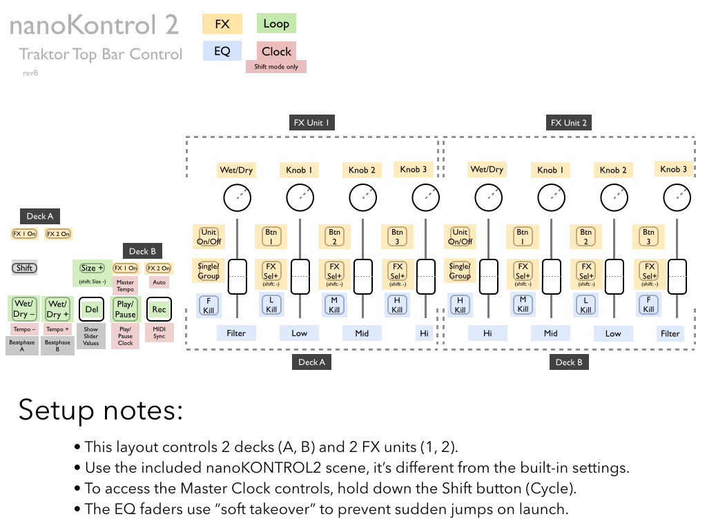
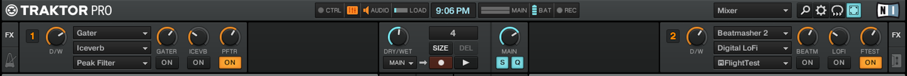
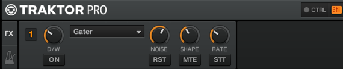
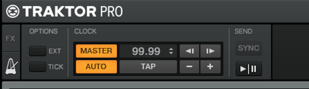

# Read Me

## gbControl-nk2 top bar control for Traktor

Control the top bar area of Traktor with a Korg nanoKONTROL2: FX units, Master Clock, Filter and EQs.

## Setup

1. Write the scene data to your nk2 with the *.nktrl2_data file
2. Import the *.tsi file into Traktor
3. Check out the layout file (optional if you like suprises)
4. GLHF

CC-BY-SA 3.0, GB 2014  
Please distribute. Please improve. Credit me if you fork and/or distribute. Above all, distribute and improve on this template.

---

